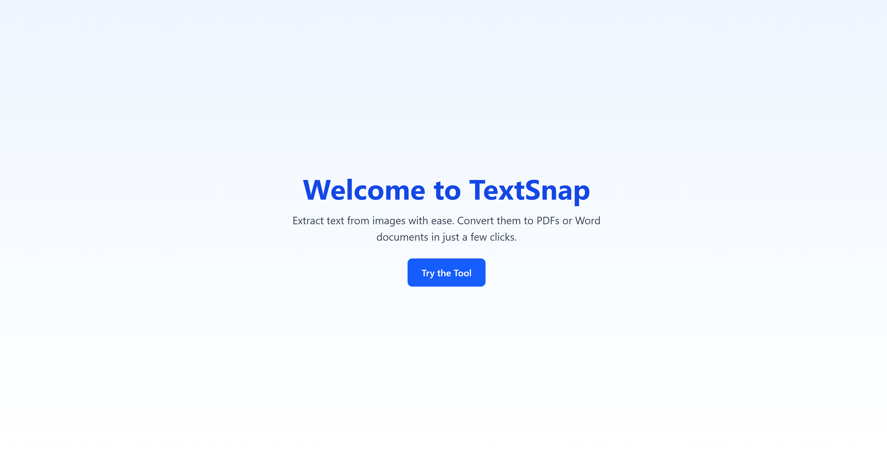
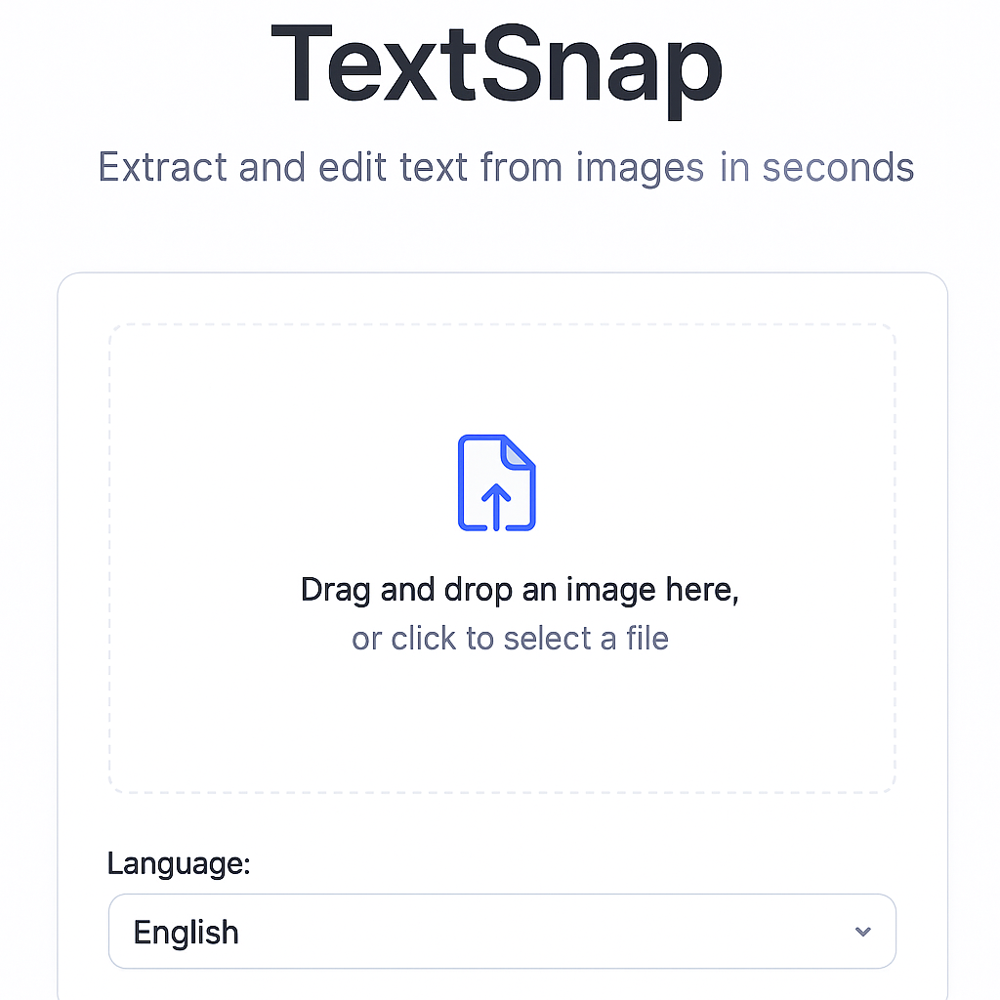
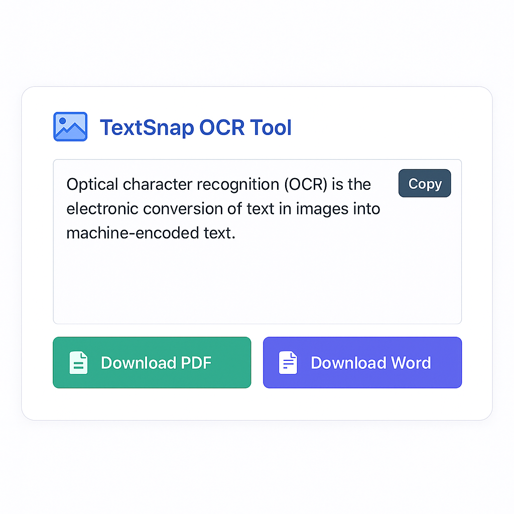

```markdown
# 🧠 Image to Text (OCR) Web App

A full-stack OCR (Optical Character Recognition) application where users can:

- Upload image(s)
- Extract text using EasyOCR
- Edit the text
- Choose a language for OCR
- Download the extracted text as a PDF

Built with **React**, **Tailwind CSS**, and **Django REST Framework**.

---



---

## 🚀 Features

- 📷 Upload image(s)
- 🌐 Multi-language OCR support
- 📤 Progress bar while uploading/processing
- ✏️ Edit extracted text before saving
- 📄 Download as PDF
- 💬 EasyOCR for accurate and lightweight text recognition

---

## 🧰 Tech Stack

| Frontend        | Backend       | OCR Engine   |
|----------------|---------------|--------------|
| React + Tailwind CSS | Django + DRF | EasyOCR (Python) |

---

## 📦 Folder Structure

```bash
image_to_text_project/
├── image2text-frontend/     # React + Tailwind frontend
└── ocr_backend/             # Django backend API using EasyOCR
```

---

## 📸 Demo Screenshots

> You can add your own screenshots or use the ones below:

| Upload Image | OCR Output & Edit |
|--------------|-------------------|
|  |  |

---

## 🛠️ Installation

### Backend (Django + EasyOCR)

```bash
cd ocr_backend
python -m venv venv
source venv/bin/activate  # On Windows use venv\Scripts\activate
pip install -r requirements.txt  # manually create this if needed
python manage.py migrate
python manage.py runserver
```

> Make sure you install the dependencies manually:
```bash
pip install django djangorestframework easyocr pillow reportlab
```

---

### Frontend (React)

```bash
cd image2text-frontend
npm install
npm start
```

---

## 🌍 Deployment

### Frontend (Vercel)

1. Push `image2text-frontend` to GitHub
2. Import it to [Vercel](https://vercel.com)
3. Use default build command: `npm run build`
4. Output directory: `build`

### Backend (Render)

1. Push `ocr_backend` to GitHub
2. Go to [Render.com](https://render.com)
3. Create a **Web Service**
4. Add a build command: `pip install -r requirements.txt`
5. Add a start command: `gunicorn ocr_backend.wsgi`
6. Add environment:
   - `PYTHON_VERSION=3.9`
   - Set `PORT=8000` if needed

---

## ⚙️ API Endpoints

| Endpoint | Method | Description |
|----------|--------|-------------|
| `/api/ocr/` | `POST` | Accepts an image and language; returns extracted text |
| `/api/pdf/` | `POST` | Accepts text and returns a downloadable PDF |
| `/api/word/` | `POST` | Accepts text and returns a downloadable Word |

---

## 🌐 Supported OCR Languages

| Code | Language |
|------|----------|
| en   | English  |
| fr   | French   |
| ar   | Arabic   |
| de   | German   |
> You can customize or extend this in both frontend and backend.

---

## 🙌 Acknowledgements

- [EasyOCR](https://github.com/JaidedAI/EasyOCR)
- [React](https://reactjs.org)
- [Django REST Framework](https://www.django-rest-framework.org)
- [Tailwind CSS](https://tailwindcss.com)

---

## 📜 License

MIT License. Feel free to fork, enhance, and contribute! 💖

---

## ✨ Contribute

Pull requests are welcome. For major changes, please open an issue first to discuss what you'd like to change.

---

## 📩 Contact

Made with 💻 by JafarScript  
Twitter: [@li_jafar](https://twitter.com/yourhandle)  
Email: lihammedjafar@gmail.com

```

---

Would you like me to generate some placeholder screenshots (`upload.png`, `edit-text.png`, `ocr-hero.png`) for you to add to the `public/` folder?